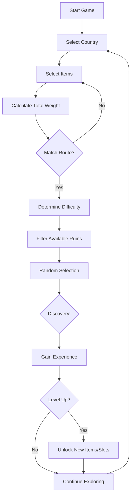

# Archaeological Explorer - Game Design Document | 考古探险家 - 游戏设计文档

## 📖 Document Overview | 文档概述

**Game Title**: Archaeological Explorer | 考古探险家

**Genre**: Casual Exploration • Educational | 休闲探索 • 教育类

**Platform**: Web Browser | 网页浏览器

**Core Concept**: Data-driven archaeological exploration game where players collect items, explore ancient ruins, and discover historical artifacts.

**核心概念**: 数据驱动的考古探索游戏，玩家收集物品、探索古代遗迹、发现历史文物。

---

## 🎮 Game Philosophy | 游戏设计哲学

### Design Pillars | 设计支柱

1. **Simplicity** | **简洁性**
   - Pure weight-based mechanics, no complex formulas
   - 纯权重机制，无复杂公式
   - Three-tier difficulty system
   - 三级难度系统
   - Intuitive progression
   - 直观的进度系统

2. **Freedom** | **自由度**
   - No required item combinations
   - 无强制物品组合
   - Player-driven exploration strategy
   - 玩家主导的探索策略
   - Multiple paths to same goal
   - 通往同一目标的多条路径

3. **Education** | **教育性**
   - Real archaeological sites and artifacts
   - 真实的考古遗址和文物
   - Historical context and citations
   - 历史背景和引用来源
   - Cultural heritage awareness
   - 文化遗产意识

4. **Data-Driven** | **数据驱动**
   - Complete code-data separation
   - 完全的代码数据分离
   - Content team can work independently
   - 内容团队可独立工作
   - Easy expansion and modification
   - 易于扩展和修改

---

## 🏗️ System Architecture | 系统架构

### Overall Structure | 整体结构

```
┌─────────────────────────────────────────────────┐
│          Archaeological Explorer Game           │
├─────────────────────────────────────────────────┤
│                                                 │
│  ┌──────────────┐  ┌──────────────┐           │
│  │  Frontend    │  │   Backend    │           │
│  │  (React)     │  │  (Node.js)   │           │
│  └──────┬───────┘  └──────┬───────┘           │
│         │                  │                    │
│         └────────┬─────────┘                    │
│                  │                              │
│         ┌────────▼────────┐                    │
│         │  Game Engines   │                    │
│         ├─────────────────┤                    │
│         │ • Route Matcher │                    │
│         │ • Exploration   │                    │
│         │ • State Manager │                    │
│         └────────┬────────┘                    │
│                  │                              │
│         ┌────────▼────────┐                    │
│         │ Configuration   │                    │
│         │   Files (JSON)  │                    │
│         ├─────────────────┤                    │
│         │ • Items         │                    │
│         │ • Routes        │                    │
│         │ • Ruins         │                    │
│         │ • Level System  │                    │
│         └─────────────────┘                    │
│                                                 │
└─────────────────────────────────────────────────┘
```

### Technology Stack | 技术栈

**Frontend | 前端**
- React 18 + Vite
- React Router (routing)
- React Context (state management)
- CSS3 (styling)

**Backend | 后端**
- Node.js + Express
- SQLite (user data)
- JWT (authentication)

**Configuration | 配置**
- JSON files (game content)
- Markdown (documentation)

---

## 🎯 Core Game Systems | 核心游戏系统

### 1. Item System | 物品系统

**Purpose**: Define exploration equipment and their properties

**目的**: 定义探索装备及其属性

#### Item Properties | 物品属性

| Property | Type | Description |
|----------|------|-------------|
| `itemId` | number | Unique identifier (1001-1015) |
| `itemName` | string | Display name |
| `itemDescription` | string | Educational description |
| `itemIcon` | string | Image path |
| `itemCategory` | string | Category (digging/detection/etc.) |
| `explorationWeight` | number | Exploration power (1-10) |
| `rarity` | string | common/rare/legendary |
| `isDefaultOwned` | boolean | Default owned at start |
| `citation` | string | Reference URL |

#### Weight Distribution | 权重分布

- **Common (1-3)**: Basic tools (10 items)
- **普通 (1-3)**: 基础工具（10个物品）

- **Rare (4-6)**: Advanced equipment (3 items)
- **稀有 (4-6)**: 高级装备（3个物品）

- **Legendary (10)**: Cutting-edge technology (2 items)
- **传说 (10)**: 尖端科技（2个物品）

**Total Items**: 15

**配置文件**: `/public/game-content/item-config/items.json`

**文档**: `/documents/item_config.md`

---

### 2. Route System | 路线系统

**Purpose**: Match player loadout to exploration methods

**目的**: 将玩家配置匹配到探索方法

#### Route Difficulty | 路线难度

| Difficulty | Weight Range | Description |
|------------|--------------|-------------|
| **Beginner** | 1-20 | Surface exploration, basic tools |
| **Advanced** | 15-50 | Moderate excavation, specialized equipment |
| **Master** | 40-999 | Deep exploration, professional setup |

#### Route Matching Logic | 路线匹配逻辑

```javascript
1. Player selects items → Calculate total weight
2. Match route by weight range → Get route difficulty
3. Filter ruins by difficulty → ruins.requiredDifficulty <= route.routeDifficulty
4. Apply country filter (UI selection)
5. Random selection based on discovery probability
6. Return discovered ruin
```

**Key Features** | **关键特性**:
- ✅ No required items - pure weight-based
- ✅ 无必需物品 - 纯权重驱动
- ✅ Not tied to countries
- ✅ 不绑定国家
- ✅ Overlapping weight ranges for smooth transitions
- ✅ 重叠权重范围实现平滑过渡

**Total Routes**: 3

**配置文件**: `/public/game-content/route-config/routes.json`

**文档**: `/documents/route_config.md`

---

### 3. Ruins System | 遗迹系统

**Purpose**: Define discoverable archaeological sites

**目的**: 定义可发现的考古遗址

#### Site Hierarchy | 站点层级

```
Site (Country/Region)
  └─ Ruins (Specific Archaeological Site)
      └─ Discovery Result
```

#### Current Sites | 当前站点

1. **🇨🇳 China** (4 ruins)
   - Terracotta Warriors, Great Wall, Forbidden City
   - Sanxingdui (hidden, 20% probability)

2. **🇪🇬 Egypt** (4 ruins)
   - Valley of Kings, Giza Pyramids, Karnak Temple
   - Great Sphinx (hidden, 25% probability)

3. **🇬🇷 Greece** (2 ruins)
   - Theatre of Dionysus, Mycenae

**Total Ruins**: 10 (8 normal + 2 hidden)

#### Ruins Properties | 遗迹属性

| Property | Description |
|----------|-------------|
| `requiredDifficulty` | Minimum route difficulty (beginner/advanced/master) |
| `discoverProbability` | Base discovery chance (0-1) |
| `isHidden` | Whether it's a hidden discovery |
| `location` | Geographic location (mandatory) |
| `citation` | Reference URL (mandatory) |

**配置文件**: 
- `/public/game-content/site-config/sites.json`
- `/public/game-content/site-config/ruins.json`

**文档**: `/documents/SITES_RUINS_SUMMARY.md`

---

### 4. Level System | 等级系统

**Purpose**: Player progression and item slot management

**目的**: 玩家进度和物品槽位管理

#### Level Progression | 等级进度

| Level | Exp Req | Item Slots | New Items | Milestone |
|-------|---------|------------|-----------|-----------|
| 1 | 0 | 3 | 6 basic (default) | Game start |
| 2 | 50 | 3 | Trowel, Drone, Wheelbarrow | Excavation |
| 3 | 110 | 4 | Satellite, Tape Measure, Line Level | +1 slot |
| 4 | 185 | 5 | Magnetometry | +1 slot |
| 5 | 275 | 6 | LiDAR, GPR | +1 slot, Legendary! |
| 6 | 385 | 7 | - | +1 slot |
| 7 | 515 | 8 | - | +1 slot, MAX |
| 8-10 | 670-1060 | 8 | - | Perks only |

**Max Level**: 10

#### Experience Rewards | 经验值奖励

- Normal Discovery: +25 exp
- Hidden Discovery: +50 exp
- First Time: +30 exp
- Exploration Bonus: +15 exp
- Complete Site: +100 exp

**配置文件**: `/public/game-content/user-config/level-system.json`

**文档**: `/documents/level_system.md`

---

## 🔄 Game Loop | 游戏循环

### Core Gameplay Flow | 核心玩法流程



### Player Journey | 玩家旅程

#### Early Game (Level 1-3) | 早期游戏

**Goal**: Learn mechanics, discover famous ruins

**目标**: 学习机制，发现著名遗迹

- Start with 6 basic items (weight 8)
- Can carry 3 items
- Access to Beginner routes only
- Discover: Pyramids, Terracotta Warriors, Great Wall

#### Mid Game (Level 4-6) | 中期游戏

**Goal**: Build strategy, unlock advanced routes

**目标**: 建立策略，解锁进阶路线

- Unlock rare items (Magnetometry, Drone)
- Can carry 5-7 items
- Access to Advanced routes
- Discover: Karnak Temple, Forbidden City, Mycenae

#### Late Game (Level 7-10) | 后期游戏

**Goal**: Master exploration, find hidden ruins

**目标**: 精通探索，发现隐藏遗迹

- Unlock legendary items (LiDAR, GPR)
- Can carry 8 items (MAX)
- Access to Master routes
- Discover: Great Sphinx, Sanxingdui (hidden)

---

## 📊 Data Architecture | 数据架构

### Configuration Files | 配置文件结构

```
/public/game-content/
├── item-config/
│   └── items.json                 # 15 items
├── route-config/
│   └── routes.json                # 3 routes
├── site-config/
│   ├── sites.json                 # 3 countries
│   └── ruins.json                 # 10 ruins
└── user-config/
    └── level-system.json          # 10 levels
```

### Data Flow | 数据流

```
Configuration Files (JSON)
    ↓ Load
Game Engine (JavaScript)
    ↓ Process
React Context (State)
    ↓ Render
UI Components (React)
    ↓ User Interaction
Backend API (Node.js)
    ↓ Persist
Database (SQLite)
```

### Single Source of Truth | 单一数据源原则

✅ **Item unlocking**: `level-system.json` → `levels[].unlockedItems`

✅ **Route difficulty**: `routes.json` → `routeDifficulty`

✅ **Ruins discovery**: `ruins.json` → `requiredDifficulty` + `discoverProbability`

❌ **Avoid duplication**: No `requiredLevel` in items.json

❌ **Avoid bidirectional references**: No `availableRoutes` in ruins.json

---

## 🎨 Design Decisions | 设计决策

### 1. Weight-Only Matching | 仅权重匹配

**Why**: Simplicity and flexibility

**为什么**: 简洁性和灵活性

❌ **Rejected**: Required item combinations

✅ **Chosen**: Any items, only weight matters

**Benefits**:
- Easy to understand
- Strategic freedom
- Easy to balance

### 2. Three-Tier Difficulty | 三级难度

**Why**: Clear progression without complexity

**为什么**: 清晰的进度，无复杂性

❌ **Rejected**: 5+ difficulty levels

✅ **Chosen**: Beginner / Advanced / Master

**Benefits**:
- Easy to understand
- Smooth transitions (overlapping ranges)
- Sufficient depth

### 3. Slot-Based Progression | 槽位进度系统

**Why**: Natural power gating

**为什么**: 自然的能力限制

❌ **Rejected**: Level-locked items

✅ **Chosen**: Item slots increase with level

**Benefits**:
- All items available early (good UX)
- Slots limit early power
- Clear level rewards

### 4. No Country-Route Binding | 路线不绑定国家

**Why**: Scalability and flexibility

**为什么**: 可扩展性和灵活性

❌ **Rejected**: Routes tied to specific countries

✅ **Chosen**: Routes are exploration methods, not locations

**Benefits**:
- Add new countries without new routes
- Reduce configuration complexity
- Better separation of concerns

---

## 📈 Progression Balance | 进度平衡

### Experience Curve | 经验值曲线

```
Level 1-3:  Fast progression (~5-10 discoveries)
Level 4-6:  Moderate progression (~15-20 discoveries)
Level 7-10: Slow progression (~30+ discoveries)
```

### Power Curve | 能力曲线

```
Level 1:  Weight 8  (3 slots) → Beginner only
Level 3:  Weight 18 (4 slots) → Advanced accessible
Level 5:  Weight 34 (6 slots) → Master accessible
Level 7:  Weight 59 (8 slots) → Full Master power
```

### Content Unlock Curve | 内容解锁曲线

```
Level 1:  5 ruins accessible (Beginner tier)
Level 3:  8 ruins accessible (+Advanced tier)
Level 5:  10 ruins accessible (+Master tier, including hidden)
```

---

## 🛠️ Three Core Engines | 三大核心引擎

### 1. Route Matching Engine | 路线匹配引擎

**Location**: `/src/utils/gameEngine.js`

**Function**: Match player's item loadout to exploration routes

**功能**: 将玩家物品配置匹配到探索路线

```javascript
matchRoute(selectedItems, totalWeight) {
  // Find routes that match weight range
  const eligibleRoutes = routes.filter(route => 
    totalWeight >= route.minWeight && 
    totalWeight <= route.maxWeight
  )
  
  // Return highest priority route
  return eligibleRoutes.sort((a, b) => 
    a.routePriority - b.routePriority
  )[0]
}
```

### 2. Exploration Engine | 探索计算引擎

**Location**: `/src/utils/gameEngine.js`

**Function**: Generate exploration results and discoveries

**功能**: 生成探索结果和发现

```javascript
explore(selectedCountry, selectedItems) {
  // 1. Match route
  const route = matchRoute(selectedItems)
  
  // 2. Filter ruins by difficulty and country
  const availableRuins = ruins.filter(ruin =>
    ruin.siteId === selectedCountry &&
    ruin.requiredDifficulty <= route.routeDifficulty
  )
  
  // 3. Random selection with probability
  const discovered = selectRandom(availableRuins)
  
  return discovered
}
```

### 3. State Management Engine | 状态管理引擎

**Location**: `/src/contexts/GameContext.jsx`

**Function**: Manage player progress, inventory, and discoveries

**功能**: 管理玩家进度、库存和发现记录

**Manages**:
- User authentication
- Player level and experience
- Owned items
- Discovered ruins
- Exploration history

---

## 🎓 Educational Components | 教育性组件

### 1. Real Historical Content | 真实历史内容

Every ruin includes:
- ✅ Accurate historical description
- ✅ Geographic location
- ✅ Reference URL (citation)
- ✅ Discovery date and context

### 2. Cultural Awareness | 文化意识

Sites represent:
- 🇨🇳 China: Ancient Chinese civilization
- 🇪🇬 Egypt: Ancient Egyptian civilization  
- 🇬🇷 Greece: Ancient Greek civilization

### 3. Archaeological Tools Education | 考古工具教育

Each item includes:
- Real archaeological tool description
- How it's used in field work
- Reference link for further learning

---

## 📱 User Interface | 用户界面

### Page Structure | 页面结构

1. **Home** - Game overview and quick start
2. **Exploration** - Main gameplay (item selection + exploration)
3. **Inventory** - Item management and stats
4. **Gallery** - Discovered ruins collection
5. **Profile** - User stats and progress

### UI Principles | UI原则

- **Minimalist**: Clean, focused interface
- **极简主义**: 简洁、专注的界面

- **Visual Feedback**: Clear state changes
- **视觉反馈**: 清晰的状态变化

- **Tooltip-based Info**: Hover for details
- **工具提示信息**: 悬停查看详情

- **Responsive**: Works on all devices
- **响应式**: 适配所有设备

---

## 🔮 Future Expansion | 未来扩展

### Potential Features | 潜在功能

1. **More Countries** 
   - 🇮🇹 Italy (Pompeii, Colosseum)
   - 🇲🇽 Mexico (Chichen Itza, Teotihuacan)
   - 🇵🇪 Peru (Machu Picchu)

2. **Item Combinations**
   - Synergy bonuses for specific item sets
   - 特定物品组合的协同加成

3. **Achievements System**
   - Badges for milestones
   - 里程碑徽章

4. **Social Features**
   - Leaderboards
   - 排行榜
   - Discovery sharing
   - 发现分享

5. **Daily Challenges**
   - Special exploration missions
   - 特殊探索任务

---

## 📚 Documentation Index | 文档索引

### Configuration Documentation | 配置文档

| Document | Purpose | Link |
|----------|---------|------|
| **Item Config** | 物品配置说明 | `/documents/item_config.md` |
| **Route Config** | 路线配置说明 | `/documents/route_config.md` |
| **Sites & Ruins** | 站点遗迹总结 | `/documents/SITES_RUINS_SUMMARY.md` |
| **Level System** | 等级系统说明 | `/documents/level_system.md` |
| **Dynamic Weight** | 动态权重系统 | `/documents/DYNAMIC_WEIGHT_SYSTEM.md` |

### Technical Documentation | 技术文档

- **README.md**: Project overview and setup
- **README.md**: 项目概述和设置

- **API Documentation**: Backend endpoints
- **API文档**: 后端接口

---

## 🎯 Project Goals | 项目目标

### Achieved | 已实现

✅ Complete data-code separation

✅ Three-tier difficulty system

✅ Weight-based exploration mechanics

✅ 10 levels with item slot progression

✅ 15 items across 3 rarity tiers

✅ 10 archaeological ruins in 3 countries

✅ User authentication and persistence

✅ Comprehensive documentation

### In Progress | 进行中

🔄 Frontend UI polish

🔄 User experience optimization

🔄 Content expansion

### Planned | 计划中

📋 Additional countries and ruins

📋 Achievement system

📋 Social features

---

## 🏆 Success Metrics | 成功指标

### Content Metrics | 内容指标

- **15 items** configured and balanced
- **3 routes** with clear difficulty tiers
- **10 ruins** with historical accuracy
- **10 levels** with meaningful progression

### System Metrics | 系统指标

- **100% data-driven**: All content in JSON
- **Zero hardcoded content** in source code
- **Single source of truth** for all configurations
- **Full documentation coverage**

### Quality Metrics | 质量指标

- **Clear progression**: Level 1-10 designed for ~30-50 discoveries
- **Balanced difficulty**: All routes accessible with appropriate loadout
- **Educational value**: All ruins have citations and historical context

---

## 👥 Team Workflow | 团队工作流程

### Roles | 角色分工

**Content Team** | **内容团队**
- Edit JSON configuration files
- Add new ruins, items, and routes
- Update descriptions and citations

**Development Team** | **开发团队**
- Maintain game engines
- Implement new features
- Optimize performance

**Both Teams** | **两个团队**
- Keep documentation in sync
- Test configuration changes
- Ensure data consistency

---

## 📝 Version History | 版本历史

### v0.1 - Initial Release (2025-11-01)

**Core Systems**:
- ✅ Item system (15 items)
- ✅ Route system (3 routes)
- ✅ Ruins system (10 ruins)
- ✅ Level system (10 levels)

**Key Features**:
- Weight-based exploration
- Three-tier difficulty
- Slot progression system
- Complete data-driven architecture

**Documentation**:
- Item configuration guide
- Route configuration guide
- Sites & ruins summary
- Level system guide
- **Game design document** ← You are here!

---

## 🔗 Quick Links | 快速链接

### Configuration Files | 配置文件

- [items.json](../public/game-content/item-config/items.json)
- [routes.json](../public/game-content/route-config/routes.json)
- [sites.json](../public/game-content/site-config/sites.json)
- [ruins.json](../public/game-content/site-config/ruins.json)
- [level-system.json](../public/game-content/user-config/level-system.json)

### Documentation | 文档

- [Item Configuration](./item_config.md)
- [Route Configuration](./route_config.md)
- [Sites & Ruins Summary](./SITES_RUINS_SUMMARY.md)
- [Level System](./level_system.md)
- [Dynamic Weight System](./DYNAMIC_WEIGHT_SYSTEM.md)

---

*Last Updated: 2025-11-01*

*Document Version: 1.0*
